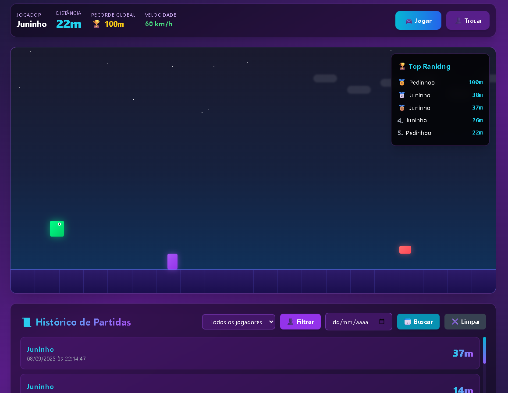

# Jogo da Ameba Rankeada

Esse projeto foi desenvolvido pelo discente Kauan de Torres Eiras, matrícula 232014727, como trabalho de Estrutura de Dados 2 - 2025.2. O intuito desse trabalho era aplica conhecimentos de Estruturas de Busca em projetos práticos. O jogo foi desenvolvido com React e TypeScript, e as estruturas de dados como BST, Binary Search, HashTable e Linear Search foram implementadas para aplicar os conceitos aprendidos.



## 📊 **Estruturas de Dados Implementadas e Seus Usos**

### 1. **HashTable (Tabela Hash)**
```javascript
class HashTable {
  private map: Map<string, string> = new Map();
  
  set(id: string, name: string) { ... }
  get(id: string) { ... }
  getAllNames(): string[] { ... }
  toObject() { ... }
  load(obj: Record<string, string>) { ... }
}
```

**Uso no jogo:**
- **Armazena perfis únicos** de jogadores
- **Chave**: nome do jogador, **Valor**: nome do jogador
- **Operações O(1)** para inserção e busca
- Usado para popular o dropdown de filtro de jogadores
- Persiste dados no localStorage

**Onde é usado:**
```javascript
profiles.current.set(name, name);
profiles.current.getAllNames()
localStorage.setItem("dino_profiles", JSON.stringify(profiles.current.toObject()));
```

---
### 2. **BST (Binary Search Tree - Árvore Binária de Busca)**
```javascript
class ScoreBST {
  root: BSTNode | null = null;
  
  insert(distance: number, record: GameRecord) { ... }
  findMax(): GameRecord | null { ... }
  inOrder(): GameRecord[] { ... }
}
```

**Uso no jogo:**
- **Mantém ranking ordenado** por distância
- **Encontra recorde global** eficientemente
- **Traversal in-order** retorna ranking do maior para menor

**Onde é usado:**
```javascript
bst.current.insert(r.distance, r);

const maxRecord = bst.current.findMax();
if (maxRecord) {
  setHighScore(maxRecord.distance);
}

const rankingList = bst.current.inOrder();
```

**Estrutura da árvore:**
```
        500m (root)
       /           \
    600m            400m
   /    \          /    \
 700m   550m    450m   300m
```
*Valores maiores à esquerda para facilitar busca do máximo*

---

### 3. **Binary Search (Busca Binária)**
```javascript
function binarySearchByDay(records: GameRecord[], day: string): GameRecord[] {
  let left = 0;
  let right = records.length - 1;
  let firstIndex = -1;
  
  while (left <= right) {
    const mid = Math.floor((left + right) / 2);
  }
}
```

**Uso no jogo:**
- **Busca partidas por data** específica
- **Complexidade O(log n)** ao invés de O(n)
- Aproveita que records estão ordenados por data

**Onde é usado:**
```javascript
const res = binarySearchByDay(records, searchDay);
setSearchResults(res);
```

---

---

## 📈 **Análise de Complexidade**

| Operação | Estrutura | Complexidade | Uso |
|----------|-----------|--------------|-----|
| Encontrar recorde | BST | **O(log n)** | `findMax()` percorre apenas à esquerda |
| Buscar por data | Binary Search | **O(log n)** | Divide espaço de busca pela metade |
| Inserir partida | BST | **O(log n)** | Navegação pela árvore |
| Listar ranking | BST | **O(n)** | In-order traversal |
| Salvar jogador | HashTable | **O(1)** | Acesso direto por chave |
| Filtrar por nome | Linear Search | **O(n)** | Percorre todos os registros |
---
